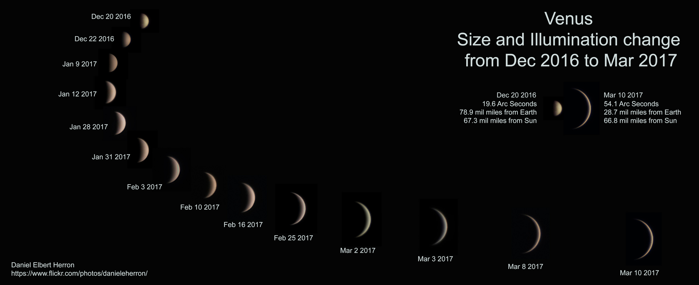
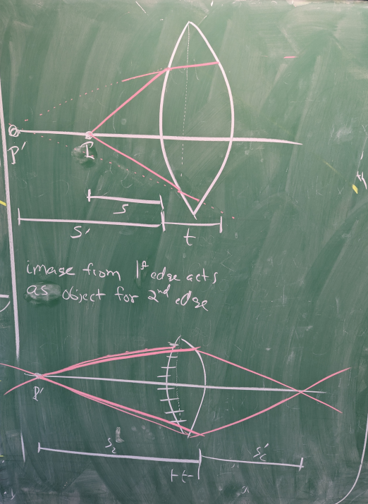

\newpage

# Intro

- Creation of eyeglasses ($\sim$ 1285 Italy)
- Telescope invented 1608 (Hans Lippershey) for military purposes
- Galileo in 1609 starts building his own telescopes. Discovers
    - mountains and craters of the Moon
    - moons of Jupiter
    - new stars in the Milky Way
    - phases of Venus (definitive proof Venus orbits Sol)

      

      

- **Telescopes have three main functions for the observer**
    1) Collect light
    2) Magnify an image
    3) Resolve fine details.
    
    The *light collecting power* (aka light grasp) of a telescope is the most important aspect.
      
# Fermat's Principle

What is the "fastest" path from point $A\rightarrow B$?

{width=1.5in}

The simplest answer to this question is that fastest path is the *shortest* geometric path.
But what if your speed depends on the terrain? 

{width=1.5in}

Assume that you run faster in the sand than swim in the water.
You want to maximize time on the sand!

{width=1.5in}

You can immediately see that this cannot be an optimal path.
The "fastest" path is some intermediate one that optimizes the amount time
on sand versus water. 

{width=1.5in}

The path taken is the one that is the
*least amount of time*!

Consider the following beam path of a light ray bending between two mediums
(presume air to water). 
Let's use this principle of least time to quantify the ray path from $S$ to $P$.

{width=2.5in}

The time for the ray to travel from $S$ to $P$ is

$$ t=\frac{\bar{SO}}{v_1}+\frac{\bar{OP}}{v_2} $$

$$ t=\frac{\sqrt{x^2+h^2}}{v_1}+
     \frac{\sqrt{(a-x)^2+b^2}}{v_2}
$$

Minimize the time by setting $dt/dx=0$.

$$
\frac{dt}{dx}=
\frac{1}{v_1}(\tfrac{1}{2})\big(x^2+h^2\big)^{-1/2}(2x)+
\frac{1}{v_2}(\tfrac{1}{2})\big((a-x)^2+b^2\big)^{-1/2}(2)(a-x)(-1)
$$

$$
\frac{1}{v_1}\underbrace{\frac{x}{\sqrt{x^2+h^2}}}_\text{geometry}=
\frac{1}{v_2}\underbrace{\frac{(a-x)}{\sqrt{(a-x)^2+b^2}}}_\text{geometry}
$$

$$
\frac{\sin\theta_1}{v_1}=
\frac{\sin\theta_2}{v_2}
$$

Define the index of refraction  

$$ n_i = \frac{c}{v_i} $$

$$ \boxed{\text{Snell's Law }
n_1\sin\theta_1=
n_2\sin\theta_2
}
$$

## Image formation: Refraction

Consider a material with a refractive index $n_2$ and a spherical surface.

$R=$ radius of curvature of the surface.

From the geometry we can see that

$$ \theta_1=\alpha+\phi, \qquad 
   \theta_2=\phi-\beta
$$

$$\tan\alpha=\frac{t}{s+d}$$
$$\tan\beta=\frac{t}{s^\prime-d}$$
$$\tan\phi=\frac{t}{R-d}$$

Now apply Snell's law and make the approximation that $\theta_i$ is small.
We can assume that by considering only **paraxial rays**.
Rays that are *nearly parallel* to the optical axis.

$$
n_1\sin\theta_1=
n_2\sin\theta_2
$$

$$
n_1\theta_1=n_2\theta_2
$$

$$
n_1(\alpha+\phi)=n_2(\phi-\beta)
$$

Note that $\tan x \approx x$ for small angles, $\therefore$

$$
n_1\left(\frac{t}{s+d}+\frac{t}{R-d}\right)=
n_2\left(\frac{t}{R-d}-\frac{t}{s^\prime-d}\right)
$$

For **paraxial** rays $d\rightarrow0$

$$
n_1\left(\frac{1}{s}+\frac{1}{R}\right)=
n_2\left(\frac{1}{R}-\frac{1}{s^\prime}\right)
$$

$$
\boxed{
\frac{n_1}{s}+\frac{n_2}{s^\prime}=
\frac{n_2-n_1}{R}
}
$$

### Thin-Lens Equation

Let us determine an equation for a thin lens by using our previous result.
Treat $n_1=1$ for vacuum (or air where $n$ air = 1.0003), 
and label $n_2$ as just $n$ for the index of refraction of the lens.

Consider a lens that has a **thickness** $t$ and a radius of curvature
$R_1$ on one side and $R_2$ on the other.

The rays from an object refract from the first edge of the lens and create
a virtual image behind the object.

{width=2in}

For the 1st edge we have

$$
\boxed{
\frac{1}{s_1}+\frac{n}{s_1^\prime}=\frac{n-1}{R_1}
}
$$

and the second edge we have

$$
\frac{n}{s_2}+\frac{1}{s_2^\prime}=\frac{1-n}{R_2}
$$

$$ s_2=t+|s_1^\prime| $$

For this case we have a virtual image $\therefore\, s_1^\prime<0$.

$$ s_2=t-s_1^\prime $$

and our 2nd edge equation becomes

$$
\frac{n}{t-s_1^\prime}+\frac{1}{s_2^\prime}=\frac{1-n}{R_2}
$$

**Thin lens approximation**: $t\rightarrow0$.
Our 2nd edge equation becomes

$$
-\frac{n}{s_1^\prime}+\frac{1}{s_2^\prime}=\frac{1-n}{R_2}
$$

Add the 1st edge equation to this result

$$
\frac{1}{s_1}+\frac{1}{s_2^\prime}=\frac{n-1}{R_1}+\frac{1-n}{R_2}
$$

$$
\frac{1}{s_1}+\frac{1}{s_2^\prime}=(n-1)\left(\frac{1}{R_1}-\frac{1}{R_2}\right)
$$

We define the right hand side of this equation as the focal length.
If the object is infinitely far away than $s_2^\prime$ equals the focal length of the lens.
We drop the 1,2 notation since we only care about the object and the resulting final image.

$$
\boxed{
\text{Lens maker's equation: } \frac{1}{f}=
(n-1)\left(\frac{1}{R_1}-\frac{1}{R_2}\right)
}
$$

$$
\boxed{
\text{thin-lens equation: }
\frac{1}{s}+\frac{1}{s^\prime}=\frac{1}{f}
}
$$

Let's use these principles to build a simple two lens telescope

\newpage

# Telescope optics: Basic Principles

Refraction and reflections are primary principles behind telescopes

**Grab knight and work out examples of compound lens problem**

# Collecting light
