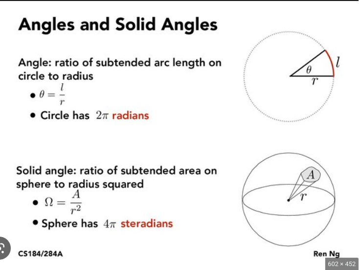

\newpage
# Units and Light
(Not textbook notes but stuff I added)

Below is a list of words we associate with light, but can we give these proper *physical* definitions?

Brightness,
flux, 
intensity,
luminosity,
lux,
lumens,
magnitude,
polarization,
...

## Lumens, Luminosity, Lux
We have many **many** ways to quantify light. 
Example flashlight with adjustable end that concentrates beam or disperses it. 

- **Luminosity**: absolute measure of electromagnetic power.
  $$[L] = \frac{\text{Joules}}{{\text{second}}} = \text{Watt} $$

  $$ L\text{sol} = 3.828\times10^{26}\text{W} $$

- **Flux**: How bright does a light source appear?
  Depends on luminosity, **distance**, and amount of dust
  between us and the light source.

  ](../Ch05_Quantify_Light/Inverse_square_law.png)

    $$
      \text{Flux} = \frac{\text{Luminosity}}{\text{Surface Area}}
    $$

- **Candella**: SI unit for *luminous intensity* (cd) 
  Specifically a measure of luminous power per solid angle,
  **but** wavelengths are weighted.
  Weights given by *luminosity function* (model of human eyes
  sensitivity to different wavelengths)

  

  **A wax candle has a luminous intensity of about 1cd.**

- **Lumen**: unit of luminous flux ($\ell m$), a measure of **percieved** power of light.
  Luminous flux weights the power of different wavelengths based on
  the human eye sensitivity.

   
    $$
      1\ell m = 1\text{cd} \times 1 \text{sr}
    $$
    
- **Lux**: unit of luminous flux per unit area.
  Example: flashlight same distance from wall but is the beam
  concentrated or spread out.

    $$ 1\ell x = 1\ell m / m^2 $$
  
  

# Random facts about light
- $c=\lambda \nu = 2.998e8\text{m/s}$
- Energy of light given by Plank's constant times the frequency
  $$ E=h\nu \quad h=6.626\text{e-34Js} $$
- Information we can get from studying light
    - apparent brightness
    - spectral energy distribution (find example)
    - Doppler shift
    - spectral line broadening (find example)
    - Zeeman line splitting (find example)
    - temporal variations
    - polarization

  Applying physics principles we can also determine
    - light source's **distance**
    - luminosity
    - temperature
    - chemical composition
    - size
    - rotation
    - magnetic fields
    - radial and transverse velocity
    - **intervening absorption by gas and dust**
- Astronomical sources categorized as *point* and *extended*
    - **Point**: most stars
    - **Extended**: sol, nebulae, *resolved* galaxies,
      diffuse synchotron emission,
      **CMB**,
      *IR dust emission in the Solar system*.

    Light measured from the two sources has to be handled differently

# The Magnitude Scale
A star's **apparent brightness** is referred to as **magnitude**.

Higher number equals fainter object

- "Cumbersome" system inherited from antiquity
  and still widely used.

- Originally based on appearance of stars 
  between **sunset** and **astronomical twilight**
  (see figure 3)

  

  Sunset $\rightarrow$ end of twilight broken into 6
  segments. Stars that appear in the first segment
  were magnitude 1 (the brightest),
  stars appearing in the second time segment were
  magnitude 2, ...

- Human eye the only tool to quantify magnitudes for centuries.

- Invention of photometers revealed two facts

  1. Magnitude 1 was too broad. 
     Sirius *much* brighter than Regulus but both are mag1.

  2. Ratios of magnitude brightness $\approx$ 2.5.
     $$\frac{B_3}{B_4}\approx 2.5,
       \quad
       \frac{B_3}{B_5}\approx 2.5^2
     $$

     Humans see *equal brightness* ratios as equal steps in *magnitude*
     $\therefore$
     **human vision is logarithmic**

     $m$ = magnitude, $F$ = apparent brightness (flux)
     $$
        \Delta m \propto \log\left(\frac{F_2}{F_1}\right)
     $$

- 1856 Pogson proposes modern definition of magnitude scale.

    $$
      \boxed{\frac{F_1}{F_2}\equiv \left(\sqrt[5]{100}\right)^{m_2-m_1}}
      \approx 2.5119^{m_2-m_1}
    $$
    *Mag difference of 5 exactly equals ratio of 100 to 1*.

    $$
      \log\left[\frac{F_1}{F_2}\right] =
      \log\left[\left(\sqrt[5]{100}\right)^{m_2-m_1}\right]
    $$

    $$
      \log\left[\frac{F_1}{F_2}\right] = \log(100^{\dfrac{m_2-m_1}{5}})
    $$

    $$
      \log\left[\frac{F_1}{F_2}\right] = \frac{m_2-m_1}{5}\log(10^2)
    $$

    $$
      -\log\left[\frac{F_2}{F_1}\right] = \frac{m_2-m_1}{5}\,2
    $$

    $$
      \boxed{m_2-m_1 = -2.5\log\left[\frac{F_2}{F_1}\right]}
    $$

    1. Cannot identify magnitude of a single star by itself.
       Must compare stars through difference in magnitudes.

    2. No zero from log $\therefore$ 
        $$ \boxed{
            \text{Pogson Equation: }
            m_i=-2.5 \log F_i + C 
            }
        $$
       where $C$ is the *zero-point offset*.
       Astronomers have to agree a specific star has a specified magnitude
       (see Bolometric magnitude and IAU 2015 resolution B2 for examples).

- What difference in magnitude results from a *small* difference in apparent brightness?
    $$
      \Delta m = -2.5\log\left[\frac{F_2}{F_1}\right]
      \quad \rightarrow \quad
      f(x)=-2.5\log(x)
    $$
  Use a Taylor series to expand the log function
    $$
      f(x)=f(a)+\frac{1}{1!}f^\prime(a)(x-a)+
      \frac{1}{2!}f^{\prime\prime}(a)(x-a)^2+
      \frac{1}{3!}f^{\prime\prime\prime}(a)(x-a)^3
      +\ldots
    $$
  Need to change base to compute derivatives correctly

    $$ \log_b(a)=\frac{\log_c(a)}{\log_c(b)} $$

    $$ f(x)=-2.5\frac{\ln(x)}{\ln(10)} = -1.086\ln(x)$$

    $$ f(a)=-1.086\ln(x) $$

    $$ f^\prime(x) = -1.086 \frac{1}{x}, \quad f^\prime(a)=-1.086\frac{1}{a} $$

    $$ f^{\prime\prime}(x) = +1.086 \frac{1}{x^2}, 
       \quad f^{\prime\prime}(a)=+1.086\frac{1}{a^2} 
    $$

  Let $a=1$ (i.e. $F_2=F_1$)
    $$ f(x)=-1.086(x-1)+1.086 \frac{(x-1)^2}{2} + \ldots $$

  Evaluate this function at $x=F_2/F_1$ under the condition that $F_2=F_1+\epsilon$.
  $\therefore x\approx 1$ 
  and $(x-1)^n \approx 0$ for $n>1$.
  
     $$ f(x=F_2/F_1)=-1.086\left(\frac{F_2}{F_1}-1\right) + O(x^2) $$
     $$ f(x) \approx 1.086\left(\frac{F_2}{F_1}-\frac{F_1}{F_1}\right) $$
     $$ \boxed{\Delta m \approx -\frac{\Delta F}{F_1}} $$

  Suppose star 1 has a magnitude of $m_1=3.5$ and star 2 $m_2=3.6$.
  Than 
    $$ \Delta m = 0.1 $$
  and star 2 is about 10\% brighter.
    $$ 0.1 \approx \frac{\Delta F}{F_1} $$
    $$ 0.1F_1 \approx (F_2-F_1) $$
    $$ F_2 \approx 1.1F_1 $$
        

## Magnitude and Wavelength Dependence

The human eye's sensitivity to to different wavelengths means sources can appear
to have different magnitudes, even if they are the same luminosity.
Compare a flashlight to the IR beam from a TV remote.

The Pogson equation is an example of the **visual magnitude**.

$$ \boxed{
    \text{Monochromatic Pogson Equation: }
    m_\lambda=-2.5 \log F_\lambda + C 
    }
$$

**Bolometric magnitude** is the opposite of monochromatic,
and includes ALL EM radiation emitted by the source.

$$ 
    \text{Bolometric correction: }
    BC_\text{band}=m_\text{bol}-m_\text{band}
$$

$m_\text{band}$ is the magnitude in some passband.

Example: The bolometric correction to the visual magnitude,
$BC_\text{V}$, for the sun is $BC_\text{V}=-0.07$ magnitudes.

## Absolute Magnitude

**Absolute Magnitude**: The apparent magnitude a star would be *if*
it was 10 parsecs away. 

Must know the stars apparent magnitude and distance.

$$\text{\textbf{Distance Modulus}: } m-M=5\log\left(\frac{d}{10}\right)$$

| Distance Modulus | Distance (parsec) |
|------------------|-------------------|
|  1               |     15.8          |
|  5               |    100            |
| 10               |   1000            |
| 15               |  10000            |

If $d>10$pc must consider **interstellar absorption**!

](../Ch05_Quantify_Light/interstellar_absorption.jpeg)

$$\text{Apparent Distance modulus: }
  (m-M)_\lambda=(m-M)_0+A_\lambda
$$

$A_\lambda$ is absorption (in magnitude) at that passband 
(wavelength $\lambda$).

Interstellar absorption always makes an object appear further.

# Color Index

# Magnitude zero points

# Filter systems
This one seems important 

# Flux

The energy flux ($F$) or just flux, describes the brightness in physical units.

# Blackbody Radiation
