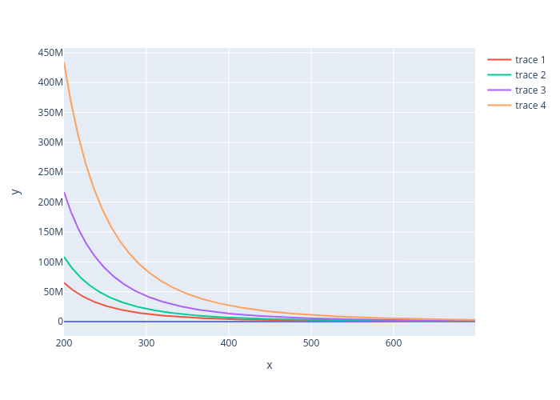

\newpage
# Units and Light
(Not textbook notes but stuff I added)

Below is a list of words we associate with light, but can we give these proper *physical* definitions?

Brightness,
flux, 
intensity,
luminosity,
lux,
lumens,
magnitude,
polarization,
...

## Lumens, Luminosity, Lux
We have many **many** ways to quantify light. 
Example flashlight with adjustable end that concentrates beam or disperses it. 

- **Luminosity**: absolute measure of electromagnetic power.
  $$[L] = \frac{\text{Joules}}{{\text{second}}} = \text{Watt} $$

  $$ L\text{sol} = 3.828\times10^{26}\text{W} $$

- **Flux**: How bright does a light source appear?
  Depends on luminosity, **distance**, and amount of dust
  between us and the light source.

  ](../Ch05_Quantify_Light/Inverse_square_law.png)


    $$
      \text{Flux} = \frac{\text{Luminosity}}{\text{Surface Area}}
    $$

- **Candella**: SI unit for *luminous intensity* (cd) 
  Specifically a measure of luminous power per solid angle,
  **but** wavelengths are weighted.
  Weights given by *luminosity function* (model of human eyes
  sensitivity to different wavelengths)

  

  **A wax candle has a luminous intensity of about 1cd.**

- **Lumen**: unit of luminous flux ($\ell m$), a measure of **percieved** power of light.
  Luminous flux weights the power of different wavelengths based on
  the human eye sensitivity.

   
    $$
      1\ell m = 1\text{cd} \times 1 \text{sr}
    $$
    
- **Lux**: unit of luminous flux per unit area.
  Example: flashlight same distance from wall but is the beam
  concentrated or spread out.

    $$ 1\ell x = 1\ell m / m^2 $$
  
  


# Random facts about light
- $c=\lambda \nu = 2.998e8\text{m/s}$
- Energy of light given by Plank's constant times the frequency
  $$ E=h\nu \quad h=6.626\text{e-34Js} $$
- Information we can get from studying light
    - apparent brightness
    - spectral energy distribution (find example)
    - Doppler shift
    - spectral line broadening (find example)
    - Zeeman line splitting (find example)
    - temporal variations
    - polarization

  Applying physics principles we can also determine
    - light source's **distance**
    - luminosity
    - temperature
    - chemical composition
    - size
    - rotation
    - magnetic fields
    - radial and transverse velocity
    - **intervening absorption by gas and dust**
- Astronomical sources categorized as *point* and *extended*
    - **Point**: most stars
    - **Extended**: sol, nebulae, *resolved* galaxies,
      diffuse synchotron emission,
      **CMB**,
      *IR dust emission in the Solar system*.

    Light measured from the two sources has to be handled differently

# The Magnitude Scale
A star's **apparent brightness** is referred to as **magnitude**.

Higher number equals fainter object

- "Cumbersome" system inherited from antiquity
  and still widely used.

- Originally based on appearance of stars 
  between **sunset** and **astronomical twilight**
  (see figure 3)

  

  Sunset $\rightarrow$ end of twilight broken into 6
  segments. Stars that appear in the first segment
  were magnitude 1 (the brightest),
  stars appearing in the second time segment were
  magnitude 2, ...

- Human eye the only tool to quantify magnitudes for centuries.

- Invention of photometers revealed two facts

  1. Magnitude 1 was too broad. 
     Sirius *much* brighter than Regulus but both are mag1.

  2. Ratios of magnitude brightness $\approx$ 2.5.
     $$\frac{B_3}{B_4}\approx 2.5,
       \quad
       \frac{B_3}{B_5}\approx 2.5^2
     $$

     Humans see *equal brightness* ratios as equal steps in *magnitude*
     $\therefore$
     **human vision is logarithmic**

     $m$ = magnitude, $F$ = apparent brightness (flux)
     $$
        \Delta m \propto \log\left(\frac{F_2}{F_1}\right)
     $$

- 1856 Pogson proposes modern definition of magnitude scale.

    $$
      \boxed{\frac{F_1}{F_2}\equiv \left(\sqrt[5]{100}\right)^{m_2-m_1}}
      \approx 2.5119^{m_2-m_1}
    $$
    *Mag difference of 5 exactly equals ratio of 100 to 1*.

    $$
      \log\left[\frac{F_1}{F_2}\right] =
      \log\left[\left(\sqrt[5]{100}\right)^{m_2-m_1}\right]
    $$

    $$
      \log\left[\frac{F_1}{F_2}\right] = \log(100^{\dfrac{m_2-m_1}{5}})
    $$

    $$
      \log\left[\frac{F_1}{F_2}\right] = \frac{m_2-m_1}{5}\log(10^2)
    $$

    $$
      -\log\left[\frac{F_2}{F_1}\right] = \frac{m_2-m_1}{5}\,2
    $$

    $$
      \boxed{m_2-m_1 = -2.5\log\left[\frac{F_2}{F_1}\right]}
    $$

    1. Cannot identify magnitude of a single star by itself.
       Must compare stars through difference in magnitudes.

    2. No zero from log $\therefore$ 
        $$ \boxed{
            \text{Pogson Equation: }
            m_i=-2.5 \log F_i + C 
            }
        $$
       where $C$ is the *zero-point offset*.
       Astronomers have to agree a specific star has a specified magnitude
       (see Bolometric magnitude and IAU 2015 resolution B2 for examples).

       $$[F] = \text{photons } \text{s}^{-1} \text{ cm}^{-2}$$

- What difference in magnitude results from a *small* difference in apparent brightness?
    $$
      \Delta m = -2.5\log\left[\frac{F_2}{F_1}\right]
      \quad \rightarrow \quad
      f(x)=-2.5\log(x)
    $$
  Use a Taylor series to expand the log function
    $$
      f(x)=f(a)+\frac{1}{1!}f^\prime(a)(x-a)+
      \frac{1}{2!}f^{\prime\prime}(a)(x-a)^2+
      \frac{1}{3!}f^{\prime\prime\prime}(a)(x-a)^3
      +\ldots
    $$
  Need to change base to compute derivatives correctly

    $$ \log_b(a)=\frac{\log_c(a)}{\log_c(b)} $$

    $$ f(x)=-2.5\frac{\ln(x)}{\ln(10)} = -1.086\ln(x)$$

    $$ f(a)=-1.086\ln(x) $$

    $$ f^\prime(x) = -1.086 \frac{1}{x}, \quad f^\prime(a)=-1.086\frac{1}{a} $$

    $$ f^{\prime\prime}(x) = +1.086 \frac{1}{x^2}, 
       \quad f^{\prime\prime}(a)=+1.086\frac{1}{a^2} 
    $$

  Let $a=1$ (i.e. $F_2=F_1$)
    $$ f(x)=-1.086(x-1)+1.086 \frac{(x-1)^2}{2} + \ldots $$

  Evaluate this function at $x=F_2/F_1$ under the condition that $F_2=F_1+\epsilon$.
  $\therefore x\approx 1$ 
  and $(x-1)^n \approx 0$ for $n>1$.
  
     $$ f(x=F_2/F_1)=-1.086\left(\frac{F_2}{F_1}-1\right) + O(x^2) $$
     $$ f(x) \approx 1.086\left(\frac{F_2}{F_1}-\frac{F_1}{F_1}\right) $$
     $$ \boxed{\Delta m \approx -\frac{\Delta F}{F_1}} $$

  Suppose star 1 has a magnitude of $m_1=3.5$ and star 2 $m_2=3.6$.
  Than 
    $$ \Delta m = 0.1 $$
  and star 2 is about 10\% brighter.
    $$ 0.1 \approx \frac{\Delta F}{F_1} $$
    $$ 0.1F_1 \approx (F_2-F_1) $$
    $$ F_2 \approx 1.1F_1 $$
        


## Magnitude and Wavelength Dependence

The human eye's sensitivity to to different wavelengths means sources can appear
to have different magnitudes, even if they are the same luminosity.
Compare a flashlight to the IR beam from a TV remote.

The Pogson equation is an example of the **visual magnitude**.

$$ \boxed{
    \text{Monochromatic Pogson Equation: }
    m_\lambda=-2.5 \log F_\lambda + C 
    }
$$

**Bolometric magnitude** is the opposite of monochromatic,
and includes ALL EM radiation emitted by the source.

$$ 
    \text{Bolometric correction: }
    BC_\text{band}=m_\text{bol}-m_\text{band}
$$

$m_\text{band}$ is the magnitude in some passband.

Example: The bolometric correction to the visual magnitude,
$BC_\text{V}$, for the sun is $BC_\text{V}=-0.07$ magnitudes.


## Absolute Magnitude

**Absolute Magnitude**: The apparent magnitude a star would be *if*
it was 10 parsecs away. 

Must know the stars apparent magnitude and distance.

$$\text{\textbf{Distance Modulus}: } m-M=5\log\left(\frac{d}{10}\right)$$

| Distance Modulus | Distance (parsec) |
|------------------|-------------------|
|  1               |     15.8          |
|  5               |    100            |
| 10               |   1000            |
| 15               |  10000            |

If $d>10$pc must consider **interstellar absorption**!

](../Ch05_Quantify_Light/interstellar_absorption.jpeg)

$$\text{Apparent Distance modulus: }
  (m-M)_\lambda=(m-M)_0+A_\lambda
$$

$A_\lambda$ is absorption (in magnitude) at that passband 
(wavelength $\lambda$).

Interstellar absorption always makes an object appear further.

# Color Index
Advances in photography in near end of 19th century allowed
**quantitative** measurements of a star's color. 

Earliest photographic plates more sensitive to blue light.

 - Blue stars appear brighter
 - Red stars appear dimmer

**Color index** is the difference between magnitudes of a star

# Flux

The energy flux ($F$) or just flux, describes the 
*apparent brightness* in physical units.

$F$ is the amount of light energy per 
unit area $(\Delta A)$ per unit time $(\Delta t)$
at given bandpass

$$F=\frac{E_\text{band}}{\Delta A \,\Delta t}$$ 
$$ [F] = \text{erg }\text{cm}^{-2}\text{ s}^{-1}
   \text{ or } \text{W}\text{cm}^{-2}
$$

$$ 1 \text{erg} = 100 \text{nJ  (an erg is a cgs unit of energy)}$$

In practice, we report the 
**monochromatic flux**, flux at a specific $\lambda$ or $\nu$.

$$F_\lambda=\frac{E_\lambda}{\Delta A \,\Delta t \, \Delta \lambda}
  \quad,\quad
  F_\nu=\frac{E_\lambda}{\Delta A \,\Delta t \, \Delta \nu}
$$

$$ \nu F_\nu = \lambda F_\lambda $$

$[F_\lambda]$=erg s$^{-1}$ cm$^{-2}$ $\AA^{-1}$ 
,
$[F_\nu]$=erg s$^{-1}$ cm$^{-2}$ Hz$^{-1}$ 

A popular unit for $F_\nu$ (for radio astronomy) is the $jansky$

$$ 1\text{ jansky} = 10^{-26}\,\text{W m}^{-2} \text{ Hz}^{-1} $$

**Note** that most optical astronomical detectors do not detect energy,
they detect photons.
$F$ from Pogson equation is measured in photons per s per cm$^2$. 

Converting flux units from photon flux to energy flux is

$$ 
  \left[ F \text{ in } \frac{\text{photons}}{\text{s } \text{cm}^2} \right]
  =
  \left[ F \text{ in } \frac{\text{energy}}{\text{s } \text{cm}^2} \right] h\nu
$$
$h\nu$ is the energy per photon.

There are *many* ways to present the 
**spectral energy distribution** (SED) of an astronomical source. 


# Blackbody Radiation

(Start with video about object "blacker" than VANTA black)

[https://youtu.be/JoLEIiza9B://youtu.be/JoLEIiza9Bc](https://youtu.be/JoLEIiza9B://youtu.be/JoLEIiza9Bc)


An object that absorbs EM-radiation at **all** wavelengths is a **blackbody**.

- idealized object (no real blackbodies but still a useful model)
- opaque
- non-reflective

**Blackbody radiation** is the *thermal* EM radiation emitted by
a blackbody that is in **thermal equilibrium** with its environment. 

The SED of blackbody depends *only* on its temperature.

- composition
- size
- shape

do not determine a blackbody's SED.

{width=2in}

## Model Blackbody Radiation: Rayleigh-Jeans Law
We can "easily" derive an expression for the EM flux of
a blackbody\footnote{Derivation based on work found here [https://elliptigon.com/raleigh-jeans/]}. 
A blackbody is a perfect absorber **and** therefore also a perfect emitter.

We'll model blackbody radiation as the EM radiation that is
in thermal equilibrium with the walls of the blackbody.
The walls of the blackbody are in thermal equilibrium 
with the "temperature" of radiation (energy in = energy out).

- Consider our blackbody cavity to be a cube of length $L$
  (it can be shown that shape does not matter
   but the analysis is easier with Cartesian symmetry).
- Walls of cavity are oscillating charge particles.
- Charge particles oscillation frequency = EM radiation frequency
- At thermal equilibrium, average energy of oscillating charge
  = to average energy EM field.

Oscillating particle has energy
\begin{gather*}
    H = \frac{p^2}{2m}+\tfrac{1}{2}aq^2 
    \\
    H = H_\text{kin}+H_\text{pot}
\end{gather*}

**Equipartition theorem**: At thermal equilibrium, energy is shared evenly among all possible forms.
$$
    \langle H\rangle=
    \langle H_\text{kin}\rangle+
    \langle H_\text{pot}\rangle
    = (\,\tfrac{1}{2}k_B T\,)+(\,\tfrac{1}{2}k_B T\,)
$$
$$
    \boxed{
    \langle H\rangle=k_B T
    }
$$
where $k_B=$Boltzmann constant = 1.381e-23 J/K.
**The outgoing EM waves of a blackbody have energy $k_BT$!**

- We have found the energy one "thermal" wave has.
- **Find the total number of waves in the cavity.**
    - Solve wave equation for standing waves
    - Count waves in $k$-space
    - Convert to wavelength space

$$\text{Wave Equation: } \Big(\nabla^2 -c^2 \frac{\partial^2}{\partial t^2} \Big) \Psi(\vec{r},t)=0$$

Ansatz: $\Psi(\vec{r},t)=\psi(\vec{r}\,)\,\phi(t)$ (for separation of variables).

$$
    \Big(\nabla^2 -c^2 \frac{\partial^2}{\partial t^2} \Big) \psi\phi=0 
$$
$$
    \phi\nabla^2\psi-c^2\psi\frac{\partial^2 \phi}{\partial t^2}=0
$$
$$
    \frac{1}{\psi}\nabla^2\psi=\frac{1}{\phi}c^2\frac{\partial^2 \phi}{\partial t^2}
$$
Left hand side depends only on position. Right hand side depends only on time,
meaning this equation must equal a constant! Call that constant $k^2$.

Focus on just the position dependent $\psi$ equation.

$$
    \nabla^2\psi=k^2\psi
$$

Ansatz: $\psi(\vec{r}\,)=E_x(x)\,E_y(y)\,E_z(z)$


$$
    \frac{d^2E_x}{dx^2}\,E_y\,E_z+
    E_x\,\frac{d^2E_y}{dy^2}\,E_z+
    E_x\,E_y\,\frac{d^2E_z}{dz^2}=
    k^2E_x\,E_y\,E_z\
$$
Divide whole equation by $E_x\,E_y\,E_z$
$$
    \underbrace{\frac{d^2E_x}{dx^2}\frac{1}{E_x}}_\text{only x dependence}+
    \underbrace{\frac{d^2E_y}{dy^2}\frac{1}{E_y}}_\text{only y dependence}+
    \underbrace{\frac{d^2E_z}{dz^2}\frac{1}{E_z}}_\text{only z dependence} 
    =k^2
$$

$$
    \therefore \quad \frac{d^2E_x}{dx^2}\frac{1}{E_x} =
    \text{ constant }
    = (k_x)^2
$$

$$ (k_x)^2+(k_y)^2+(k_z)^2=k^2 $$
$k$ here is called the *wave-number*. 
For EM waves $k=2\pi/\lambda$.

$$
    \frac{d^2E_x}{dx^2}\frac{1}{E_x} = (k_x)^2
    \quad \Rightarrow \quad
    \frac{d^2E_x}{dx^2} = (k_x)^2 E_x
$$
    
$$E_x=A\cos(k_x x)+B \sin(k_x x)$$

Apply boundary condition for standing waves

$$ E_x(x=0)=0, \quad E_x(x=L)=0 $$

This forces the $A$ constant on cosine to be zero and we have

$$ E_x(x=L)= 0 = B\sin(k_x L) $$

This condition is only valid when

$$ k_x L = n_x \pi \quad \underbrace{n_x=1,2,3,\ldots}_\text{ask class why no n=0} $$

Apply this to the $y$ and $z$ equations to find

$$\boxed{\psi(\vec{r}\,)=B\sin(k_x x)\sin(k_y y)\sin(k_z z)}$$
and
$$k^2=\frac{\pi^2}{L^2}(n_x^2+n_y^2+n_z^2)$$
    
Look at $k$-space to count the number of standing waves.

{width=2.85in}

- Points in $k$ space are always separated by steps of $\pi/L$.
- Every $(\pi/L)^3$ cube contains one standing wave.

The number of standing waves, $N(k$), in the spherical shell shown in the diagram is
the volume between $k$ and $k+dk$, divided by $(\pi/L)^3$.

$$
    N(k)=\frac{\text{volume of $dk$ shell}}{(\pi/L)^3}
$$

$$
    \text{volume}=\frac{1}{8}\left(
        \frac{4}{3}\pi(k+dk)^3-
        \frac{4}{3}\pi k^3
    \right)
$$

$$
    \text{volume}=\frac{1}{8}\frac{4}{3}\pi\Big(
        (k^2+dk^2+2k\,dk)(k+dk)-k^3
    \Big)
$$

$$
    \text{volume}=\frac{1}{8}\frac{4}{3}\pi\Big(
        k^3+\underbrace{k^2dk}+dk^2\,k+dk^3+\underbrace{2k^2dk}+2k\,dk^2-k^3
    \Big)
$$

$$
    \text{volume}=\frac{1}{8}\frac{4}{3}\pi\Big(
        3k^2dk
    \Big)
$$

$$
    \text{volume}=\tfrac{1}{2}\pi\,k^2dk
$$


$$
    N(k)=\frac{\tfrac{1}{2}\pi\,k^2 dk}{(\pi/L)^3}
    =\frac{V k^2 dk}{2\pi^2}
$$
where $V=L^3$ is the volume of the whole cavity.

For any EM wave, there are 2 perpendicular polarizations for each mode $\therefore$
$$
    N(k)
    =\frac{V k^2 dk}{\pi^2}
$$
We'll convert from wave-number to wavelength. 

$$ k=\frac{2\pi}{\lambda} \quad \rightarrow \quad dk=(-1)\frac{2\pi}{\lambda^2}d\lambda $$

$$
  N(\lambda)=V\frac{k^2dk}{\pi^2}
    =V\frac{1}{\pi^2}
      \left(\frac{2\pi}{\lambda}\right)^2
      \left[(-1)\frac{2\pi}{\lambda^2}d\lambda\right]
$$

$$
    \boxed{
    N(\lambda)=(-V)\frac{8\pi}{\lambda^4}d\lambda
    }
$$

We now have the number of standing EM waves in the cavity at thermal equilibrium\footnote{Interpret the minus sign as waves leaving the system}.

Each wave carries energy $k_BT$, thus the energy density
of the EM fields of a blackbody at thermal equilibrium is

$$
        u(\lambda)d\lambda=k_BT\frac{N(\lambda)}{V}=
        \frac{8\pi k_BT}{\lambda^4}d\lambda
$$
$$
    \boxed{
    \text{Rayleigh-Jeans Law: }
    u(\lambda)=\frac{8\pi k_BT}{\lambda^4}}
$$

Code to produce plot

---------------------

```
import numpy as np
from scipy.constants import *
import plotly.express as px

def Rayleigh_Jeans(lambda,T):
    # lambda in nanomters
        return 8*pi*k*T/(lambda*1e-9)**4

em_spectrum=np.arange(200,700) # visible band = [380,700], lambda=200nm is UV
T=[300,500,1000,2000]

fig = px.line(x=em_spectrum,y=Rayleigh_Jeans(em_spectrum,0))
for tt in T:
    fig.add_scatter(x=em_spectrum,y=Rayleigh_Jeans(em_spectrum,tt))
    fig.write_image('Rayleign_Jeans_em_spectrum.png')

fig.show()
```

---------------------



The behavior at small wavelengths is concerning.
Lets recast our energy density in terms of frequency
and see what happens as we go to higher and higher frequencies.

$$ \lambda u(\lambda) = \nu u(\nu) $$
$$ u(\nu)=\frac{\lambda}{\nu}u(\lambda)$$
$$ u(\nu)=\frac{\lambda}{\nu} \frac{8\pi k_BT}{\lambda^4} $$
$$ u(\nu)=\frac{1}{\nu} \frac{8\pi k_BT}{\lambda^3} 
    \qquad c=\lambda \nu
$$
$$ u(\nu)=\frac{1}{\nu} \frac{8\pi k_BT}{c^3/\nu^3} $$
$$ \boxed{ u(\nu)=\frac{8\pi k_BT\nu^2}{c^3}} $$

To find the energy stored in the EM waves add up across all frequencies

$$ \int_0^\infty \frac{8\pi k_BT\nu^2}{c^3} \rightarrow \infty $$


**Ultraviolet catastrophe**! The blackbody emits an unlimited amount of energy as 
wavelength decreases into the UV range. 

Failure of classical physics!

Why does classical physics fail here?
In classical EM theory, the energy of an EM wave can take on **any** value.
The photoelectic effect showed us that light energy must come in discrete packets, photons.

Photons have quantized energy 
$E_n=nh\nu$.


### Derivation of Plank's Law

In our classical model of the blackbody, we counted up EM waves that
store the energy trapped inside the cavity\footnote{
This derivation follows the work found [https://edisciplinas.usp.br/pluginfile.php/48089/course/section/16461/qsp_chapter10-plank.pdf]}. 
Using boundary conditions to constrain the modes of oscillations.

Now add constraint that EM energy is quantized!
- Energy of a particular **mode** of frequency $\nu$ is $h\nu$. 

The energy of a mode is
$$ E(\nu)_n = n h \nu, $$

- Consider all modes to be in thermal equilibrium at temp $T$.

Use the **Boltzmann distribution** to determine the expected number of photons
in each mode. 

$$ \boxed{
    \text{Boltzmann Distribution: } 
    p_i= \frac{e^{-\mathcal{E}_i/(k_bT)}}{
               \sum_{m=0}^\infty e^{-\mathcal{E}_i/(k_bT)}
    }
}$$

- $p_i$ : probability a single mode has energy $\mathcal{E}_i$.
- $\mathcal{E}_i$ : energy of state $i$
- $k_b T$ : thermal energy of the system
- $\sum_{m=0}^\infty e^{-\mathcal{E}_i/(k_bT)}$ : The partition function.
  Describes statistical properties of a system in thermal equilibrium.

**Alternate way to describe this Boltzmann Distribution**:
$p_i$ is the probability that a state contains $n$ photons 
at frequency $\nu$.

The mean energy of the mode of frequency $nu$ is

$$\bar{E}(\nu)=\sum_{n=0}^\infty E_n \, p_n $$

Note that : $\sum_{n=0}^\infty p_n=1$

$$\bar{E}(\nu)=\sum_{n=0}^\infty E_n \left(\frac{e^{-E_n/(k_bT)}}{
               \underbrace{\sum_{m=0}^\infty e^{-E_i/(k_bT)}}_{A}
    }
    \right)
$$

Let $\beta=1/k_bT$

$$\bar{E}(\nu)=\sum_{n=0}^\infty E_n \left(\frac{e^{-\beta E_n}}{A}\right)$$

$$=\frac{\sum_{n=0}^\infty E_n e^{-\beta E_n}}{A}$$


$$=\frac{\sum_{n=0}^\infty E_n e^{-\beta E_n}}{\sum_{m=0}^\infty e^{-\beta E_i}}$$

$$=\frac{\sum_{n=0}^\infty (nh\nu) e^{-\beta (nh\nu)}}{\sum_{m=0}^\infty e^{-\beta E_i}}$$

Let $x=\exp(-\beta h\nu)$

$$=h\nu\frac{\sum_{n=0}^\infty n x^n}{\sum_{m=0}^\infty x^m}$$

$$=h\nu\frac{0+x+2x^2+3x^3+\cdots}{1+x+x^2+x^3+\cdots}$$

$$\boxed{\bar{E}(\nu)=h\nu\,x\frac{1+2x+3x^2+\cdots}{1+x+x^2+x^3+\cdots}}$$

Look closely at the series in the denominator.

$$1+x+x^2+x^3+\cdots$$

**Assume this series has a finite sum** and call that value $S$.

$$S=1+x+x^2+x^3+\cdots$$

$$xS=x+x^2+x^3+\cdots$$

$$xS=S-1$$

$$1=S-xS$$

$$S=\frac{1}{1-x}$$

$$\frac{1}{1-x}=1+x+x^2+x^3+\cdots$$

**Caution**: Not a rigorous proof. Only valid if $x<1$
or $\exp(-h\nu/(k_bT))<1$.

Next step is unexpected but really awesome!

$$\frac{d}{dx}\left[\frac{1}{1-x}\right]=\frac{d}{dx}[1+x+x^2+x^3+\cdots]$$

$$\frac{1}{(1-x)^2}=0+1+2x+3x^2+\cdots$$
which is the numerator in our mean energy calculation!

$$\bar{E}(\nu)=h\nu\,x\frac{1}{(1-x)^2}\frac{1}{\frac{1}{1-x}}$$

$$=h\nu\frac{x}{1-x}$$

$$=h\nu\frac{1}{x^{-1}-1}$$

$$\boxed{
  \text{Plank's Law: }
\bar{E}(\nu)=\frac{h\nu}{e^{h\nu/(k_bT)}-1}}$$


What does Plank's law look like in the low frequency limit?
$h\nu << k_bT$

$$e^x=1+x+\frac{1}{2!}x^2+\frac{1}{3!}x^3+\cdots$$

If $x<<1$ than

$$e^x\approx 1+x$$

and
$$\bar{E}(\nu)=k_bT.$$
For large wavelengths, we recover the classical energy of the system!

\newpage

**Plank Law** gives the correct flux for a blackbody.

$$
    B_\nu(\nu,T)=\frac{2h\nu^3}{c^2} \frac{1}{\text{exp}\left(\frac{h\nu}{k_B T}\right)-1}
$$
$$
    B_\lambda(\lambda,T)=\frac{2hc^2}{\lambda^5} \frac{1}{\text{exp}\left(\frac{hc}{\lambda k_B T}\right)-1}
$$

Plank's constant: $h$=6.626e-34 Js

$[B_{\nu,\lambda}]$ = power emitted from surface, per unit area, per unit solid angle, per spectral unit (frequency, wavelength).

ex: $B_\lambda$ is the amount of energy emitted each second over a 
wavelength interval of 1 unit length (cm, nm, Å, $\ldots$)
by a surface area of 1 m$^2$ into a solid angle

- Low frequency limit $h\nu<<k_BT$
  
  $$B_\lambda = 2\frac{hc}{\lambda^5} \frac{1}{e^x-1} \qquad x=\frac{hc}{k_bT \lambda}<<1 $$
  $$ e^x \approx 1+x $$
  $$B_\lambda \approx 2\frac{hc}{\lambda^5} \frac{1}{\frac{hc}{k_b T \lambda}}$$
  $$B_\lambda \approx 2\frac{k_b T}{\lambda^4} \qquad \text{(Rayleigh-Jeans law again)}$$


- High frequency limit $h\nu>>k_BT$

    $$B_\nu = 2\frac{h\nu^3}{c^2}\frac{1}{e^{h\nu/k_b T}-1}$$
    $$B_\nu \approx 2\frac{h\nu^3}{c^2}e^{-h\nu/k_b T} \qquad \text{(Wein approximation)}$$

\newpage
### Wein's Displacement Law

We want to know what wavelength (for a given temperature) is the peak radiance at.

{width=2in}

To find a local max of a function 

$$\frac{\partial f}{\partial q}=0$$
and solve for $q$. Technically we also need to check concavity but we can gloss over that for now.

$$\frac{\partial}{\partial \lambda}[B_\lambda]=0$$

$$0=\frac{\partial}{\partial \lambda}\left[\frac{2hc^2}{\lambda^5}
    \frac{1}{e^{hc/\lambda k_b T}-1} \right] $$

$$0=(-5)2\frac{hc^2}{\lambda^6} \frac{1}{e^{hc/\lambda k_b T}-1}
    +2\frac{hc^2}{\lambda^5}(-1)(e^{hc/\lambda k_b T}-1)^{-2}
     \left((-1)\frac{hc}{\lambda^2 k_b T}e^{hc/\lambda k_b T}\right)
$$

$$\text{let } x=\frac{hc}{\lambda k_b T}$$

$$0=-5 \frac{2hc^2}{\lambda^6}\frac{1}{e^x-1}+\frac{2hc^2}{\lambda^7}
    \frac{1}{(e^x-1)^2}
    \frac{hc}{k_b T}e^x
$$

$$0=-5\frac{1}{e^x-1}+\frac{1}{\lambda}\frac{e^x}{e^x-1}\frac{hc}{k_b T}$$

$$0=-5+\frac{e^x}{e^x-1}x$$

$$\boxed{x=5(1-e^{-x})}$$

Make quick sketch by checking limits of this function.


Use a numerical approach to solve this problem

| x | $5(1-e^{-x})$ |
|---|-----------------|
| 1 | negative number |
| 2 | 4.32... |
| 3 | 4.75... |
| 4 | 4.91... |
| 5 | 4.96... |

Solution is some value between $x=4$ and $x=5$.

Use Newton's method to get the roots of this function.

\newpage


$$ f^\prime(x_n)=\frac{\Delta y}{\Delta x}
   = \frac{f(x_n-0}{x_n-x_{n+1}}$$

$$ \boxed{
    x_{n+1}=x_n-\frac{f(x_n)}{f^\prime(x_n)}
}$$

$$ f(x)=x-5(1-e^{-x})$$

$$ f(x)=5e^{-x}+x-5 \qquad f^\prime(x)=-5e^{-x} + 1 $$

Take $x_0=4$ and run this code.

-------

```
import numpy as np
x=np.zeros(10)
x[0]=4
for ii in range(len(x)-1):
    x[ii+1]=x[ii]+(5*np.exp(-x[ii])+x[ii]-5)/(-5*np.exp(-x[ii])+1)

print(x)
```
-------


$$x=4.96511423$$

$$ x=\frac{hc}{\lambda k_b} \frac{1}{T} $$

$$ \lambda=\frac{hc}{x k_b} \frac{1}{T} $$

$$ \boxed{ \lambda_\text{peak}=\frac{0.002897\text{mK}}{T} \qquad \text{Wein's Displacement Law} } $$

Now we have a mechanism to determine the peak wavelength radiated by a blackbody at a given temperature.
Let's apply this to stellar properties we can now determine.
We'll model stars as spherical blackbodies and calculate their luminosity.

$$ dL=B_\lambda d\lambda\,dA\,d\Omega $$

$$L=\int_0^\pi \int_0^{4\pi R^2} \int_0^\infty
    2\frac{hc^2}{\lambda^5}
    \frac{1}{e^{hc/\lambda k_b T}-1}
    d\lambda
$$


$$L=\pi (4\pi R^2) \int_0^\infty
    2\frac{hc^2}{\lambda^5}
    \frac{1}{e^{hc/\lambda k_b T}-1}
    d\lambda
$$

let 
$$ x=\frac{hc}{k_b T}\frac{1}{\lambda}
    ,
    \qquad
   dx=(-1)\frac{hc}{k_b T}\frac{1}{\lambda^2} d\lambda
$$

$$
    \frac{1}{\lambda}=x\frac{k_b T}{hc}
    , \qquad
    dx=(-1) \frac{x}{\lambda} d\lambda
$$

$$ L=\pi(4\pi R^2) \int_\infty^0 \frac{2hc^2}{\lambda^5}


